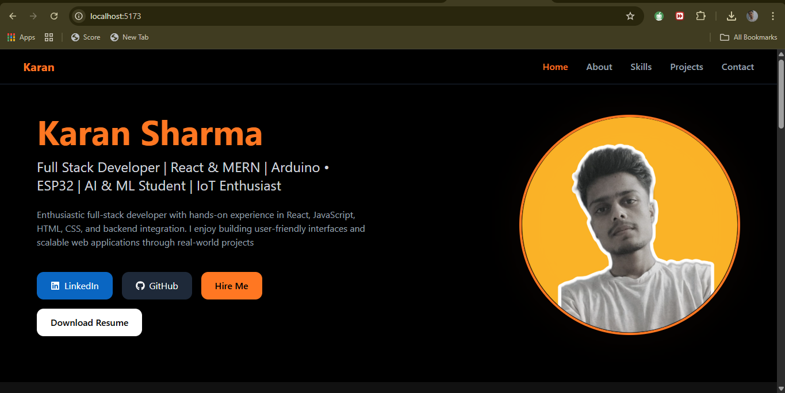
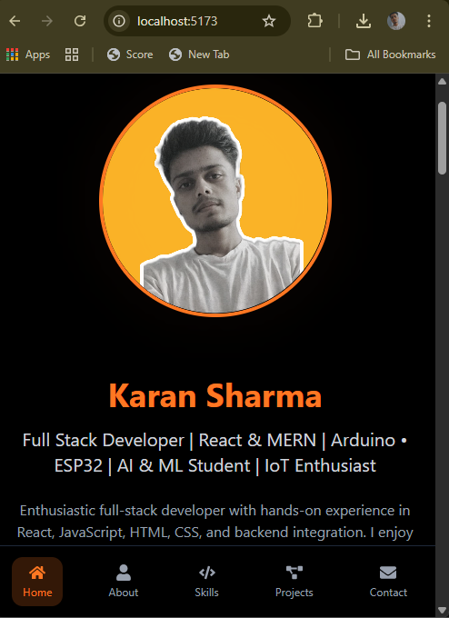
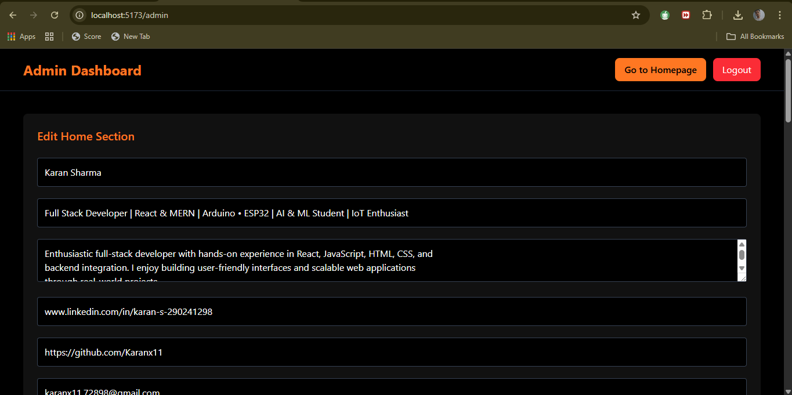

# 🚀 MERN Portfolio with Admin Dashboard

    A full-stack personal portfolio website built using the MERN stack, featuring a secure admin dashboard where all content (Home, About, Skills, Projects, Contact) can be managed dynamically.

    The portfolio is fully responsive, optimized for mobile and desktop, and includes authentication, OTP-based signup, password reset, and auto skill icons.

## ✨ Features

### 🌐 Public Portfolio

    Hero section with profile image, resume, and social links
    About section (dynamic content)
    Skills section with auto-detected icons
    Projects with image upload, GitHub & Live links
    Contact form (messages stored in DB)
    Smooth scrolling & active navbar highlight
    Fully responsive (desktop + mobile bottom navbar)

### 🔐 Admin Dashboard

    Secure login & signup (OTP-based)
    Forgot password with OTP
    Edit Home, About, Skills, Projects
    Upload profile image & resume
    Add / delete skills (icon auto-handled)
    Add / delete projects with image upload
    View & delete contact messages
    Mobile-friendly admin UI

## 🛠️ Tech Stack

### Frontend

    React (Vite)

    Tailwind CSS

    React Router

    Axios

    React Icons

### Backend

    Node.js

    Express.js

    MongoDB (Mongoose)

    JWT Authentication

    Multer (file uploads)

    Nodemailer (OTP emails)

## 📁 Project Structure

### Frontend (/frontend)
    src/
    ├── assets/
    ├── components/
    │   ├── admin/
    │   └── portfolio/
    │   └── Navbar.jsx
    ├── pages/
    │   ├── Admin.jsx
    │   ├── Login.jsx
    │   ├── Signup.jsx
    │   ├── ForgotPassword.jsx
    │   └── Portfolio.jsx
    ├── routes/
    │   └── ProtectedRoute.jsx
    ├── utils/
    │   └── axiosConfig.js
    ├── App.jsx
    ├── main.jsx
    └── index.css

### Backend (/backend)

    backend/
    ├── middleware/
    ├── models/
    ├── routes/
    ├── uploads/
    ├── .env
    ├── server.js
    └── package.json

## ⚙️ Environment Variables

    Create a .env file inside /backend:

        PORT=5000
        MONGO_URI=your_mongodb_connection_string
        JWT_SECRET=your_jwt_secret
        EMAIL_USER=your_email@gmail.com
        EMAIL_PASS=your_app_password

## 🚀 Installation & Setup

### 1️⃣ Clone the Repository
    git clone https://github.com/your-username/mern-portfolio.git
    cd mern-portfolio

### 2️⃣ Backend Setup
    cd backend
    npm install
    npm run dev

    Server will start at:
    http://localhost:5000

### 3️⃣ Frontend Setup
    cd frontend
    npm install
    npm run dev

    Frontend will run at:
    http://localhost:5173

## 🔐 Authentication Flow

    Admin Signup → Email OTP verification

    Login → JWT stored in localStorage

    Protected Admin routes

    Forgot Password → OTP → Reset password

## 📸 Screenshots

### Portfolio (Desktop)

### Portfolio (Mobile)

### Admin Dashboard

## 🧑‍💻 Author

    Karan Sharma
    Full Stack Developer (MERN)

    GitHub: https://github.com/Karanx11
    LinkedIn: www.linkedin.com/in/karan-s-290241298

## ⭐ Support

    If you like this project:
    ⭐ Star the repository
    🐛 Report issues
    🤝 Contributions welcome