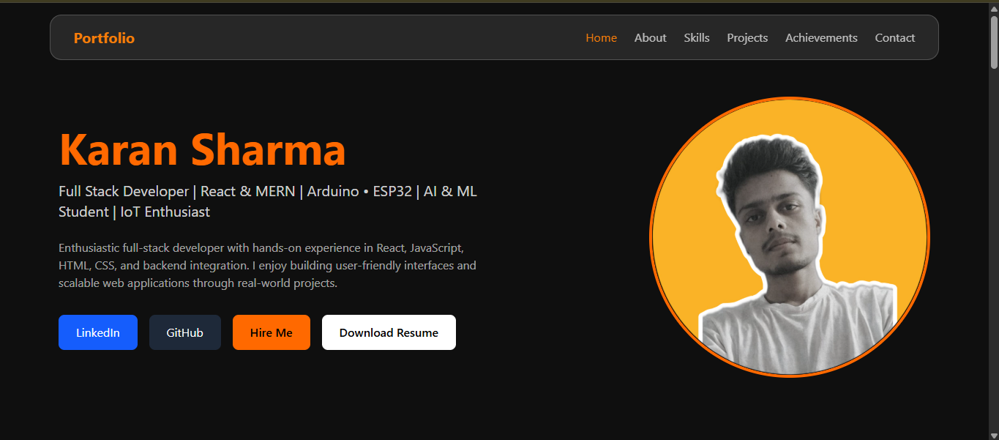
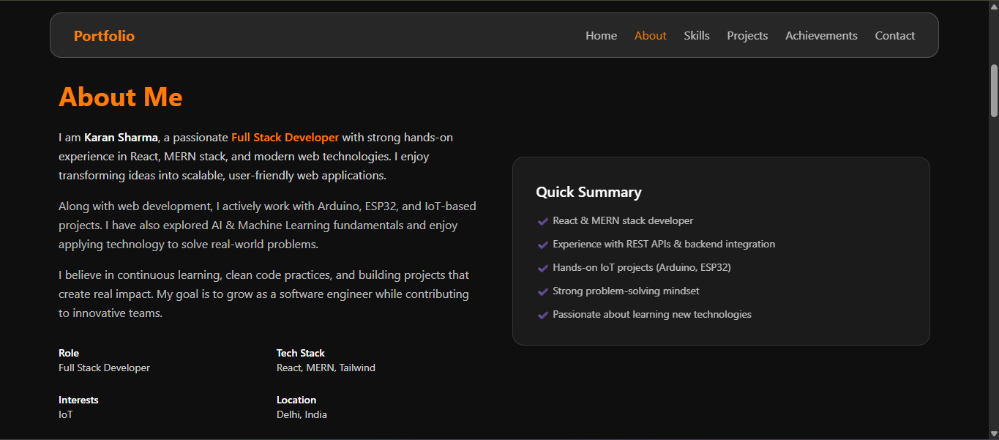
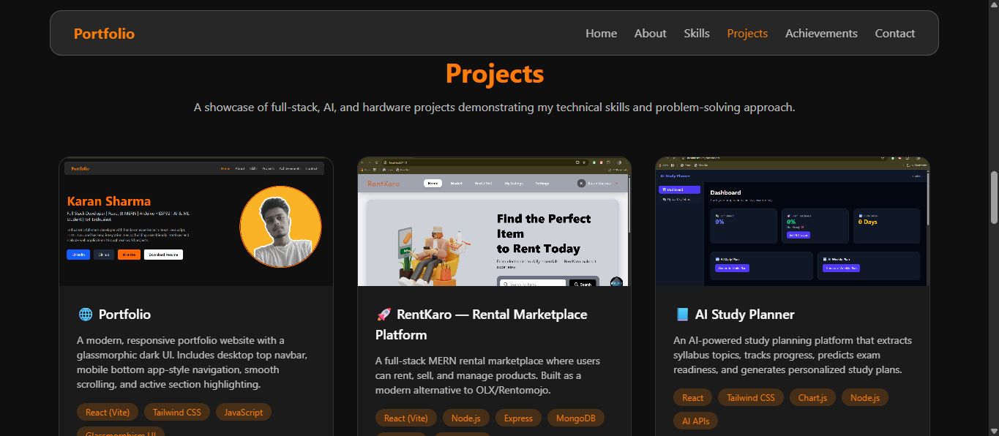
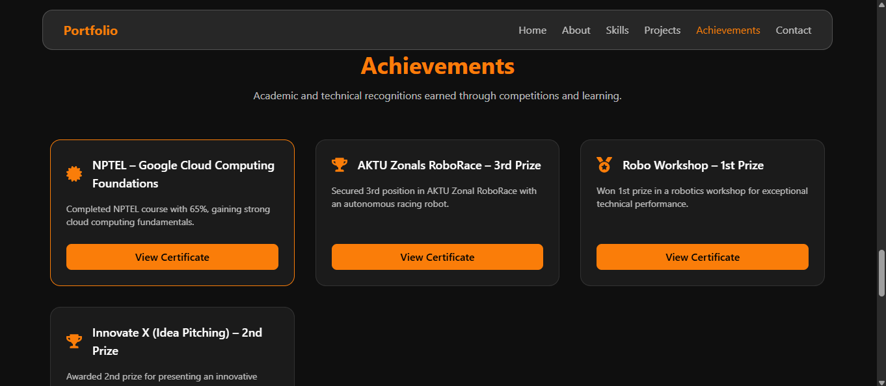
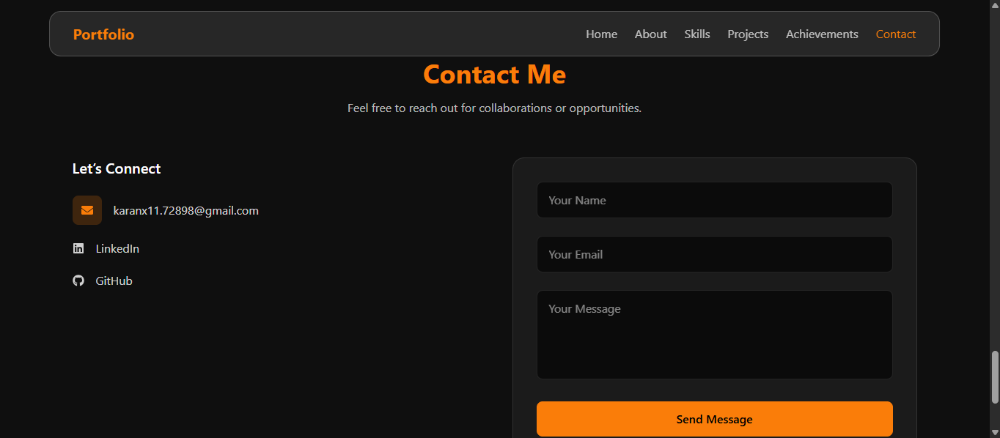

# 📌 Karan Sharma — Developer Portfolio

    🚀 A modern, responsive developer portfolio website showcasing my full-stack, AI, and hardware projects, built with a clean glassmorphic dark UI and smooth user experience across devices.

    Designed to reflect my skills, projects, and achievements in a professional and recruiter-friendly way.

## ✨ Features

    🌙 Dark Glassmorphism UI

    🖥️ Desktop Top Navigation Bar

    📱 Mobile Bottom App-Style Navigation

    🎯 Active Section Highlighting

    🧭 Smooth Scroll Navigation

    🧩 Project Showcase with Images

    🏆 Achievements Section with Certificates

    📄 Downloadable Resume

    📬 Working Contact Form (EmailJS)

    ⚡ Built with Vite for fast performance

## 🛠️ Tech Stack

### Frontend

    React (Vite)
    Tailwind CSS
    JavaScript (ES6+)
    React Icons

### Utilities & Services

    EmailJS (Contact Form)
    GitHub Pages / Netlify (Deployment)

## 📂 Project Structure
    portfolio/
    ├── public/
    │   ├── Karan_Sharma.pdf
    │   ├── _redirects
    │   └── screenshots/
    │       ├── home.png
    │       ├── projects.png
    │       ├── achievements.png
    │       └── contact.png
    ├── src/
    │   ├── assets/
    │   │   └── projects/
    │   ├── components/
    │   ├── hooks/
    │   ├── pages/
    │   ├── App.jsx
    │   └── main.jsx
    ├── vite.config.js
    └── README.md

## 📸 Screenshots

### 🏠 Home Section

### About Section 

### 💼 Projects Section

### 🏆 Achievements Section

### 📬 Contact Section

## ⚙️ Installation & Setup

### 1️⃣ Clone the Repository
    git clone https://github.com/Karanx11/portfolio.git
    cd portfolio

### 2️⃣ Install Dependencies
    npm install

### 3️⃣ Start Development Server
    npm run dev

### 📍 Runs at:
    http://localhost:5173

### 🚀 Build for Production
    npm run build
    Build output will be generated in the dist/ folder.

## 🌍 Deployment

    This portfolio is optimized for deployment on:
    Netlify
    Vercel
    GitHub Pages

    For Netlify (Vite):

    Build Command: npm run build

    Publish Directory: dist

## 📬 Contact

    📧 Email: karanx11.72898@gmail.com

    💼 LinkedIn: linkedin.com/in/karan-s-290241298

    🐙 GitHub: github.com/Karanx11

## 📄 License

    This project is licensed under the MIT License — feel free to use and customize it.

    ⭐ If you like this portfolio, consider giving it a star on GitHub!